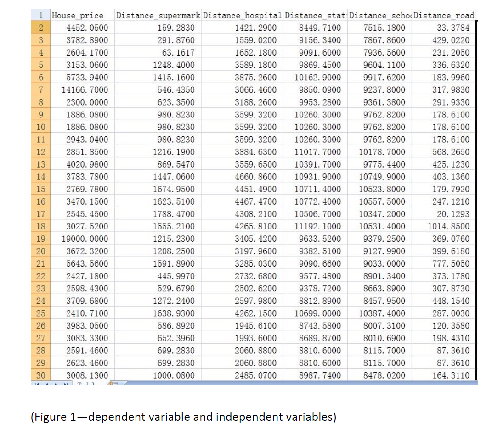
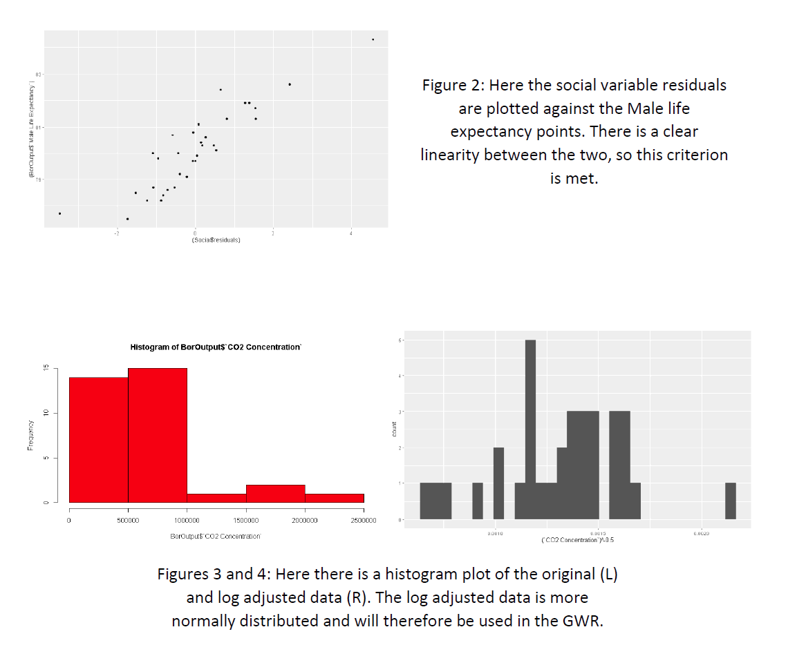
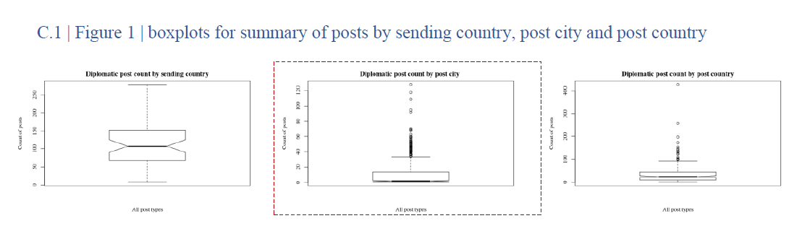
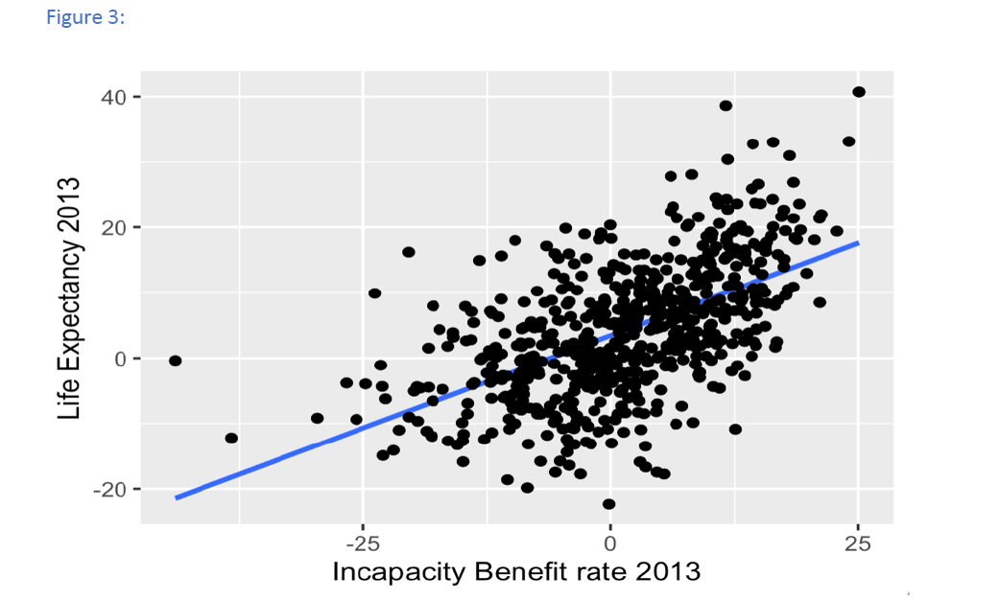

# Recap 
 
Graphs request to be **clear, precise and efficient**, below listed some requirement of graphs:

* Have a title or figure caption 
* Label axes
* Axis labels with units
* Have a legend
* Legible font size
* good resolution

  
**Tip**: When you are ready to begin creating your figures,it worthwhile to understand the manuscript requirement first.so let use have a look at the CASA0005 assessment mark scheme.

   {width=100% height=400}
   
Meanwhile,different journal or publisher have different requirements in Figures.

-  [SAGE Publishing manuscript Submission Guidelines](https://uk.sagepub.com/en-gb/eur/manuscript-submission-guidelines#Artwork)

-  [Manuscript Submission Guidelines](https://www3.nd.edu/~pkamat/pdf/graphs.pdf)
 
-  [Nature submission guidelines](https://www.nature.com/srep/author-instructions/submission-guidelines)
 
-  [Wiley manuscript preparation guidelines](https://authorservices.wiley.com/asset/photos/electronic_artwork_guidelines.pdf)
 

Graphic in academic research is general expected to be clear, concise and easy to read. Now let's have a look at some examples in GIS course assignment last year.

{out.wide="100%"}
{out.wide="100%"}
{out.wide="100%"}

{out.wide="100%"}

