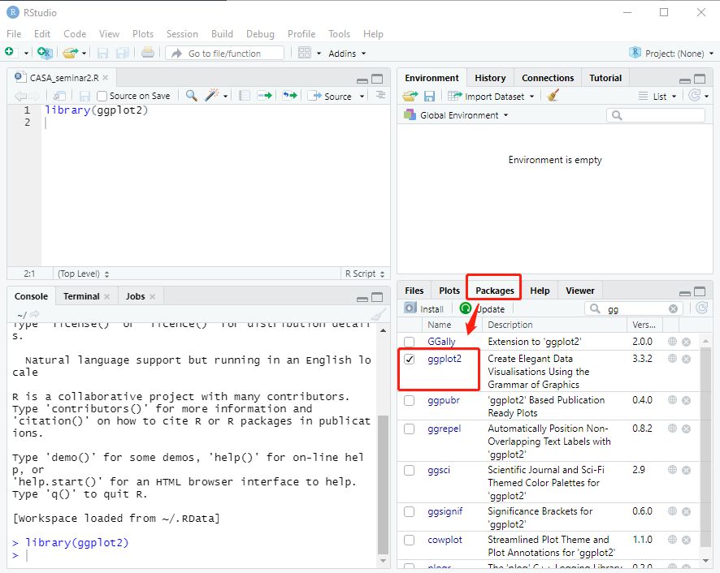

# Getting started
  
## Installing ggplot2 package

If you have installed ggplot2 package before, you can jump to the next step.
```{r}
#install.packages("ggplot2")
```


## Loading ggplot2 package
Load the packages for today's seminar.  
```{r}
#load the package for this seminar
library(ggplot2)
```

**Note:** Once you loaded the package successfully, there will be a check mark display before the package under your Packages tab at the bottom right pane.
<center>


</center>

## Dataset
Let’s start by loading two datasets. The first dataset records 924 transaction in 2009 for two local authorities in England. The second the data records the median house price per square meter for each region in England between 2009 and 2016. These two datasets are derived from a linked house price in England ([CASA working paper213](https://www.ucl.ac.uk/bartlett/casa/publications/2019/sep/casa-working-paper-213)).

```{r}
# read in the first dataset
housedata1<-read.csv("data1.csv")
# read in the second dataset
housedata2 <- read.csv("data2.csv")
```

The first house price dataset contains seven fields. They separately refer to transaction price, transaction date.transaction year, property’s total floor area, the Census 2011 local authority district code, the Census 2011 local authority district name and region name.

<center>


</center>
<br>
The second house price dataset contains four fields.They separately refer to the Census 2011 region code, transaction year, house price per square meter and region name.
<center>


</center>
