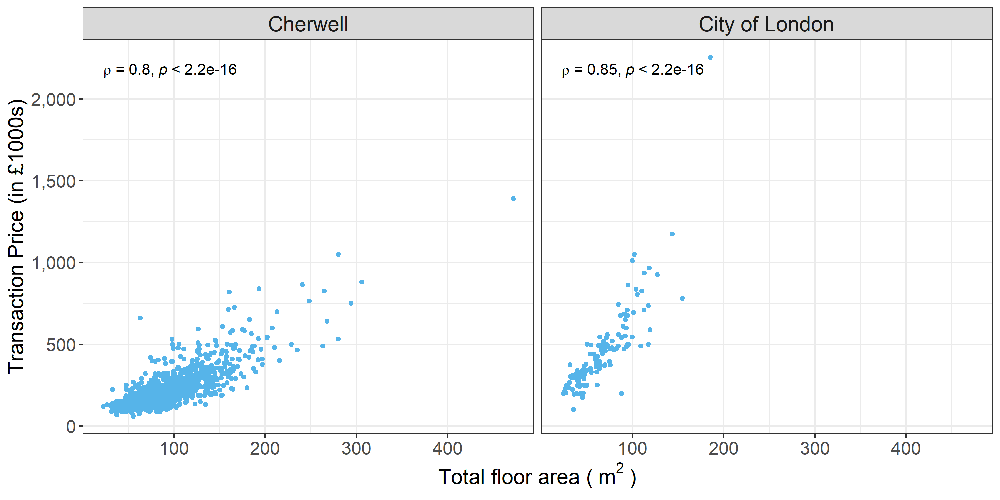

# Graphics with ggplot2
  
## Basic components of a ggplot2 Plot
There are two ways to produce plots in ggplot2, one is `qplot()` and the other is `ggplot()`. In this seminar we focus on `ggplot`.
 
[Data Visualization with ggplot2 Cheat Sheet - RStudio](https://rstudio.com/wp-content/uploads/2015/03/ggplot2-cheatsheet.pdf)

>ggplot2 is based on the grammar of graphics, the idea that you can build every graph from the same few components: a **data** set, a set of **geoms**—visual marks that represent data points, and a coordinate system.
  
## Building a simple ggplot plot
Now let us start by creating a scatter plot using `ggplot()`.The scatter plot is created to explore the relationship between transaction price and total floor area in two different local authorities. 
<br> 
  
### Make sure your datasets are data frames
Since ggplot only works with **data frames**, we use `is.data.frame()`to check the whether the data is a data frame. If it is not, you need to convert it to a data frame.
```{r}
#test the data set is a data frame
#is.data.frame(housedata1)
#is.data.frame(housedata2)
```
<br> 
  
### Plot background and set the x and y axis
```{r}
ggplot(housedata1,aes(x=tfarea,y=price))
```
<br> 
  
### Add a layer 

```{r}
ggplot(housedata1,aes(x=tfarea,y=price))+
  geom_point()
```
<br> 
    
### Color the point
In ggplot, additional aesthetic values can be added in based on other properties from our dataset. Given that housedata1 records transaction price in two local authorities, we can color the points differently depending on the ldnm field.
```{r}
ggplot(housedata1,aes(x=tfarea,y=price))+
  geom_point(aes(color=ldnm))
```
<br> 
  
### Add a linear regression line
To add a linear regression line to a scatter plot, we can do this by adding `stat_smooth()`,`method = lm`  where `lm` means linear model i.e. use linear regression

```{r}
ggplot(housedata1,aes(x=tfarea,y=price,group=ldnm))+
  geom_point(aes(color=ldnm))+
  geom_smooth(method="lm")
```
<br>
  
### Split a single plot into many related plots
  
You can split the scatter plot for each local authority with `facet_wrap()`.
```{r}
ggplot(housedata1,aes(x=tfarea,y=price,group=ldnm))+
  geom_point(aes(color=ldnm))+
  geom_smooth(method="lm")+
  facet_wrap(~ ldnm)
```
<br>
  
## Customizing the graph
  
### Change the point colour
The colour of the points can be control with the `color` aesthetic. Below is the code to colour all the points in blue.
```{r}
ggplot(housedata1,aes(x=tfarea,y=price,group=ldnm))+
  geom_point(color="#56b4e9")+
  geom_smooth(method="lm")+
  facet_wrap(~ ldnm)
```
<br>
  
### Change the point size
The size of the points can be controlled with the `size` aesthetic. The default value of size is 2. The size can be set to 1.2 by the following code.
```{r}
ggplot(housedata1,aes(x=tfarea,y=price,group=ldnm))+
  geom_point(color="#56b4e9",size = 1.2)+
  geom_smooth(method="lm")+
  facet_wrap(~ ldnm)
```
<br>
  
### Change the point shape
The size of the points can be controlled with the `shape` aesthetic. The default shape is solid circles and you can change with [Point Shape Options in ggplot](https://blog.albertkuo.me/post/point-shape-options-in-ggplot/). The following code shows you how to plot the points as solid squares.
```{r}
ggplot(housedata1,aes(x=tfarea,y=price,group=ldnm))+
  geom_point(color="#56b4e9",size = 1.2, shape=15)+
  geom_smooth(method="lm")+
  facet_wrap(~ ldnm)
```
<br>
  
### Modify fitted regression lines

The default color of the fit line is blue. This can be change by setting `colour`,The following code sets a red fit line.
```{r}
#method 1
ggplot(housedata1,aes(x=tfarea,y=price,group=ldnm))+
  geom_point(color="#56b4e9",size = 1.2)+
  geom_smooth(method="lm",colour = "red")+
  facet_wrap(~ ldnm)
# method 2
ggplot(housedata1,aes(x=tfarea,y=price,group=ldnm))+
  geom_point(color="#56b4e9",size = 1.2)+
  geom_smooth(method="lm",colour = "#FF0000")+
  facet_wrap(~ ldnm)
```
<br>
  
The grey area near the fit line is the confidence region.you can disabled it with `se = FALSE`.
```{r}
ggplot(housedata1,aes(x=tfarea,y=price,group=ldnm))+
  geom_point(color="#56b4e9",size = 1.2)+
  geom_smooth(method="lm",se = FALSE)+
  facet_wrap(~ ldnm)
```
<br>
  
### Change the axis titles
The labs function can be used to change axis labels.Here are two ways to change the axis title.
```{r}
#Method 1
ggplot(housedata1,aes(x=tfarea,y=price,group=ldnm))+
  geom_point(color="#56b4e9",size = 1.2)+
  facet_wrap(~ ldnm)+
  labs(x = "Total floor area", y = "Transaction price")
#Method 2
ggplot(housedata1,aes(x=tfarea,y=price,group=ldnm))+
  geom_point(color="#56b4e9",size = 1.2, shape=15)+
  facet_wrap(~ ldnm)+
  xlab("Total floor area")+
  ylab("Transaction price")

  
```
<br>
  
### Add axis labels and units
  
#### Formatting y axis and labels
Below is the code for adding in the y axis units in ggplot().
```{r}
ggplot(housedata1,aes(x=tfarea,y=price,group=ldnm))+
  geom_point(color="#56b4e9",size = 1.2)+
  facet_wrap(~ ldnm)+
  xlab("Total floor area")+
  ylab("Transaction price (£)")
```
<br>
If you want to change the units of the y axis to thousands of pounds, you can use `scale_y_continuous`.  
```{r}
ggplot(housedata1,aes(x=tfarea,y=price,group=ldnm))+
  geom_point(color="#56b4e9",size = 1.2)+
  facet_wrap(~ ldnm)+
  scale_y_continuous(name = "Transaction Price (in £1000s)",labels = function(y) y / 1000)+
  xlab("Total floor area")
```
<br>
You can also format the y labels more readably, with some common formats from the scales package.Below is the code for formatting y labels in comma.
```{r}
ggplot(housedata1,aes(x=tfarea,y=price/1000,group=ldnm))+
  geom_point(color="#56b4e9",size = 1.2)+
  facet_wrap(~ ldnm)+
  scale_y_continuous(name = "Transaction Price (in £1000s)",labels = scales::comma)+
  xlab("Total floor area")
```
<br>  

 -  to convert the y axis to a percentage scale ,you can use `scale_y_continuous(labels = scales::percent)'    
 <br>   
   
 -  to display dollars on the y axis, you can use `scale_y_continuous(labels = scales::dollar)'      
 <br>
   
 -  to display euros on the y axis, you can use `scale_y_continuous(labels = scales::dollar_format(suffix = "€", prefix = ""))'      
<br> 
  
#### Add x axis unit
  
Below are listed two approaches to labelling the x axis using math notation. [Math Notation for R Plot Titles: expression, bquote, & Greek Letters](https://trinkerrstuff.wordpress.com/2018/03/15/2246/) offers more `bquote`applications in R. 
```{r}
#method 1
ggplot(housedata1,aes(x=tfarea,y=price/1000,group=ldnm))+
  geom_point(color="#56b4e9",size = 1.2)+
  facet_wrap(~ ldnm)+
  scale_y_continuous(name = "Transaction Price (in £1000s)",labels = scales::comma)+
  xlab(bquote("Total floor area (" ~ m^2 ~ ")"))

#method 2
ggplot(housedata1,aes(x=tfarea,y=price/1000,group=ldnm))+
  geom_point(color="#56b4e9",size = 1.2)+
  facet_wrap(~ ldnm)+
  scale_y_continuous(name = "Transaction Price (in £1000s)",labels = scales::comma)+
  xlab(expression("Total floor area (" ~ m^2 ~ ")"))

```
<br>
  
#### Change x-axis breaks 

You can use the `breaks` function to change the x or y axis breaks.

```{r}
ggplot(housedata1,aes(x=tfarea,y=price/1000,group=ldnm))+
  geom_point(color="#56b4e9",size = 1.2)+
  geom_smooth(method="lm",se = FALSE)+
  facet_wrap(~ ldnm)+
  scale_y_continuous(name = "Transaction Price (in £1000s)",labels = scales::comma)+
  xlab(bquote("Total floor area (" ~ m^2 ~ ")"))+
  scale_x_continuous(breaks = c(50,100,150,200,250,300))

##using seq if the breaks interval are equal
ggplot(housedata1,aes(x=tfarea,y=price/1000,group=ldnm))+
  geom_point(color="#56b4e9",size = 1.2)+
  facet_wrap(~ ldnm)+
  scale_y_continuous(name = "Transaction Price (in £1000s)",labels = scales::comma)+
  xlab(bquote("Total floor area (" ~ m^2 ~ ")"))+
  scale_x_continuous(breaks = seq(50,300,50))
```
<br>
  
#### Specify axis plot range 
You can use `limits` to modify the axis limits.Below is an example to limit the x axis. It plots the total floor area below 300 .

```{r}
ggplot(housedata1,aes(x=tfarea,y=price/1000,group=ldnm))+
  geom_point(color="#56b4e9",size = 1.2)+
  facet_wrap(~ ldnm)+
  scale_y_continuous(name = "Transaction Price (in £1000s)",labels = scales::comma)+
  xlab(bquote("Total floor area (" ~ m^2 ~ ")"))+
  scale_x_continuous(breaks = seq(50,300,50),limits = c(0, 300))
```
<br>
  
You can follow the same step for your y axis.

```{r,warning= FALSE,error=FALSE}
ggplot(housedata1,aes(x=tfarea,y=price/1000,group=ldnm))+
  geom_point(color="#56b4e9",size = 1.2)+
  facet_wrap(~ ldnm)+
  scale_y_continuous(name = "Transaction Price (in £1000s)",labels = scales::comma)+
  xlab(bquote("Total floor area (" ~ m^2 ~ ")"))+
  scale_x_continuous(breaks = seq(50,300,50),limits = c(0, 300))+
  scale_y_continuous(limits = c(0, 1200))
```
<br>
  
### Add in title

You can use `ggtitle()` to add a title in the plot. Below is the code.
```{r}
ggplot(housedata1,aes(x=tfarea,y=price/1000,group=ldnm))+
  geom_point(color="#56b4e9",size = 1.2)+
  facet_wrap(~ ldnm)+
  scale_y_continuous(name = "Transaction Price (in £1000s)",labels = scales::comma)+
  xlab(expression("Total floor area (" ~ m^2 ~ ")"))+
  ggtitle("Transaction price against total floor area in local authorities, 2009")
 
```
<br>
  
### Change themes 
There are eight themes that can be directly used to give the plot a customized look.`theme_grey()` is the default ggplot2 theme, you can use `theme_bw()` to remove it.
```{r}
ggplot(housedata1,aes(x=tfarea,y=price/1000,group=ldnm))+
  geom_point(color="#56b4e9",size = 1.2)+
  facet_wrap(~ ldnm)+
  scale_y_continuous(name = "Transaction Price (in £1000s)",labels = scales::comma)+
  xlab(expression("Total floor area (" ~ m^2 ~ ")"))+
  theme_bw()
```
<br>
  
Below are listed the rest of six other themes, from which you can choose your favourite for your academic writing.

```{r}
ggplot(housedata1,aes(x=tfarea,y=price/1000,group=ldnm))+
  geom_point(color="#56b4e9",size = 1.2)+
  facet_wrap(~ ldnm)+
  scale_y_continuous(name = "Transaction Price (in £1000s)",labels = scales::comma)+
  xlab(expression("Total floor area (" ~ m^2 ~ ")"))+
   theme_linedraw()
```
<br>
  
```{r}
ggplot(housedata1,aes(x=tfarea,y=price/1000,group=ldnm))+
  geom_point(color="#56b4e9",size = 1.2)+
  facet_wrap(~ ldnm)+
  scale_y_continuous(name = "Transaction Price (in £1000s)",labels = scales::comma)+
  xlab(expression("Total floor area (" ~ m^2 ~ ")"))+
   theme_light()
```
<br>
  
```{r}
ggplot(housedata1,aes(x=tfarea,y=price/1000,group=ldnm))+
  geom_point(color="#56b4e9",size = 1.2)+
  facet_wrap(~ ldnm)+
  scale_y_continuous(name = "Transaction Price (in £1000s)",labels = scales::comma)+
  xlab(expression("Total floor area (" ~ m^2 ~ ")"))+
   theme_dark()
```
<br>
  
  
```{r}
ggplot(housedata1,aes(x=tfarea,y=price/1000,group=ldnm))+
  geom_point(color="#56b4e9",size = 1.2)+
  facet_wrap(~ ldnm)+
  scale_y_continuous(name = "Transaction Price (in £1000s)",labels = scales::comma)+
  xlab(expression("Total floor area (" ~ m^2 ~ ")"))+
  theme_minimal()
```
<br>
  
```{r}
ggplot(housedata1,aes(x=tfarea,y=price/1000,group=ldnm))+
  geom_point(color="#56b4e9",size = 1.2)+
  facet_wrap(~ ldnm)+
  scale_y_continuous(name = "Transaction Price (in £1000s)",labels = scales::comma)+
  xlab(expression("Total floor area (" ~ m^2 ~ ")"))+
  theme_classic()
```
<br>
  
```{r}
ggplot(housedata1,aes(x=tfarea,y=price/1000,group=ldnm))+
  geom_point(color="#56b4e9",size = 1.2)+
  facet_wrap(~ ldnm)+
  scale_y_continuous(name = "Transaction Price (in £1000s)",labels = scales::comma)+
  xlab(expression("Total floor area (" ~ m^2 ~ ")"))+
  theme_void()
```
<br>
  
The R package **ggthemes** provides another gallery of custom ggplot themes.You can see detials in [package:ggthemes • All Your Figure Are Belong To Us](https://yutannihilation.github.io/allYourFigureAreBelongToUs/ggthemes/).
<br>
  
### Change the font size

You can manually customize the ggplot by modifying the components in [theme()](https://ggplot2.tidyverse.org/reference/theme.html). Below I give a series of examples on how to change the font size in the plot. Let us do it step-by-step.
<br>
  
#### Change the font size of text in x and y axis and colour it red
```{r}
ggplot(housedata1,aes(x=tfarea,y=price/1000,group=ldnm))+
  geom_point(color="#56b4e9",size = 1.2)+
  facet_wrap(~ ldnm)+
  scale_y_continuous(name = "Transaction Price (in £1000s)",labels = scales::comma)+
  xlab(expression("Total floor area (" ~ m^2 ~ ")"))+
  theme_bw()+
  theme(axis.title = element_text(size=15,color="red"))
```
<br>

#### Change the font size of x and y labels in the plot and colour them red

```{r}
ggplot(housedata1,aes(x=tfarea,y=price/1000,group=ldnm))+
  geom_point(color="#56b4e9",size = 1.2)+
  facet_wrap(~ ldnm)+
  scale_y_continuous(name = "Transaction Price (in £1000s)",labels = scales::comma)+
  xlab(expression("Total floor area (" ~ m^2 ~ ")"))+
  theme_bw()+
  theme(axis.title = element_text(size=15),axis.text = element_text(size=13,color="red"))
```
<br>
  
#### Change the font size of facet labels in the plot and colour them red

```{r}
ggplot(housedata1,aes(x=tfarea,y=price/1000,group=ldnm))+
  geom_point(color="#56b4e9",size = 1.2)+
  facet_wrap(~ ldnm)+
  scale_y_continuous(name = "Transaction Price (in £1000s)",labels = scales::comma)+
  xlab(expression("Total floor area (" ~ m^2 ~ ")"))+
  theme_bw()+
  theme(axis.title = element_text(size=15),axis.text = element_text(size=13),strip.text = element_text(size=15,color="red"))
```
<br>
  
#### Change the font size of legend item labels in the plot and colour them red

```{r}
ggplot(housedata1,aes(x=tfarea,y=price/1000,group=ldnm))+
  geom_point(aes(color=ldnm),size = 1.2)+
  facet_wrap(~ ldnm)+
  scale_y_continuous(name = "Transaction Price (in £1000s)",labels = scales::comma)+
  xlab(expression("Total floor area (" ~ m^2 ~ ")"))+
  theme_bw()+
  theme(axis.title = element_text(size=15),axis.text = element_text(size=13),strip.text = element_text(size=15),legend.text = element_text(size=13,color="red"))


```
<br>
  
#### Change the font size of title of the legend in the plot and colour it red

```{r}
ggplot(housedata1,aes(x=tfarea,y=price/1000,group=ldnm))+
  geom_point(aes(color=ldnm),size = 1.2)+
  facet_wrap(~ ldnm)+
  scale_y_continuous(name = "Transaction Price (in £1000s)",labels = scales::comma)+
  xlab(expression("Total floor area (" ~ m^2 ~ ")"))+
  theme_bw()+
  theme(axis.title = element_text(size=15),axis.text = element_text(size=13),strip.text = element_text(size=15),legend.text = element_text(size=13),legend.title = element_text(size=15,color="red"))

```
 <br>
   
You may wonder about how to change the legend text in the above plot. Below is the answer:

```{r}
ggplot(housedata1,aes(x=tfarea,y=price/1000,group=ldnm))+
  geom_point(aes(color=ldnm),size = 1.2)+
  facet_wrap(~ ldnm)+
  scale_y_continuous(name = "Transaction Price (in £1000s)",labels = scales::comma)+
  xlab(expression("Total floor area (" ~ m^2 ~ ")"))+
  theme_bw()+
  theme(axis.title = element_text(size=15),axis.text = element_text(size=13),strip.text = element_text(size=15),legend.text = element_text(size=13),legend.title = element_text(size=15,color="red"))+
  labs(color = "Local authority")
  
```
<br>
  
### Add in the Pearson correlation coefficient result in the plot
Since the aim of this scatter plot is to explore the relationship between transaction price and property’s total floor area. The Pearson correlation coefficient is a suitable measure to show in the plot.Here we use stat_cor() from the package ggpubr.
```{r, fig.show='hide'}
# add Pearson correlation coefficient and p value in the graph

ggplot(housedata1,aes(x=tfarea,y=price/1000))+
  geom_point(color="#56b4e9",size = 1.2)+
  facet_wrap(~ ldnm)+
  scale_y_continuous(name = "Transaction Price (in £1000s)",labels = scales::comma)+
  xlab(expression("Total floor area (" ~ m^2 ~ ")"))+
  theme_bw()+
  theme(axis.title = element_text(size=15),axis.text = element_text(size=13),strip.text = element_text(size=15))+
 stat_cor(method="pearson")
 
```



<br>
  
You may wonder how to change R to rho. Here is one solution I found ([Modify stat_cor function to output “rho” instead of “R”](https://stackoverflow.com/questions/58648649/modify-stat-cor-function-to-output-rho-instead-of-r)).
```{r}
# type this first and modify output.type part
trace(ggpubr:::.cor_test, edit=TRUE)
#plot
ggplot(housedata1,aes(x=tfarea,y=price/1000))+
  geom_point(color="#56b4e9",size = 1.2)+
  facet_wrap(~ ldnm)+
  scale_y_continuous(name = "Transaction Price (in £1000s)",labels = scales::comma)+
  xlab(expression("Total floor area (" ~ m^2 ~ ")"))+
  theme_bw()+
  theme(axis.title = element_text(size=15),axis.text = element_text(size=13),strip.text = element_text(size=15))+
 stat_cor(method="pearson")
```
<br>
  
**Tip**: Once you type `trace(ggpubr:::.cor_test, edit=TRUE)` in R studio, you will get an edit window as shown above. You need only change the red square part from left to right.

{out.wide="100%"}

<br>
  
You also can change the label text location as shown below: 
```{r}
ggplot(housedata1,aes(x=tfarea,y=price/1000))+
  geom_point(color="#56b4e9",size = 1.2)+
  facet_wrap(~ ldnm)+
  scale_y_continuous(name = "Transaction Price (in £1000s)",labels = scales::comma)+
  xlab(expression("Total floor area (" ~ m^2 ~ ")"))+
  theme_bw()+
  theme(axis.title = element_text(size=15),axis.text = element_text(size=13),strip.text = element_text(size=15))+
  stat_cor(method="pearson",label.x = 150, label.y = 2000,size=5)
```
<br>
  
## Saving graphs
Plots exported directly from RStudio will only achieve a resolution of 72dpi. Higher DPI (Dots per Inch) means higher resolution. `ggsave` is used to save a high resolution graph from the screen to a file.

```{r}
#get you working directory
getwd()
#save the figure as tiff 
ggsave("Figure_A.tiff",units="in", width=12, height=6, dpi=500)  
#ggsave("first.png",units="in", width=10, height=5, dpi=300)
#ggsave("example.png", units = "cm",width = 30, height = 20 )

```
<br>
  
## Extensions

[12 Extensions to ggplot2 for More Powerful R Visualizations](https://mode.com/blog/r-ggplot-extension-packages/)

