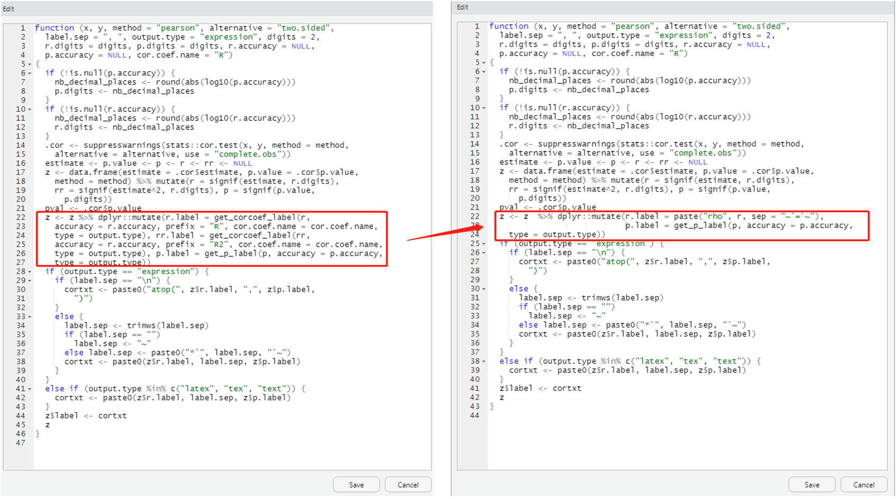

# Graphics with ggplot2
  
## Basic components of a ggplot2 Plot
There are two ways to produce plots in ggplot2, one is `qplot()` and the other is `ggplot()`. In this seminar we focus on `ggplot`.
 
[Data Visualization with ggplot2 Cheat Sheet - RStudio](https://rstudio.com/wp-content/uploads/2015/03/ggplot2-cheatsheet.pdf)

>ggplot2 is based on the grammar of graphics, the idea that you can build every graph from the same few components: a **data** set, a set of **geoms**—visual marks that represent data points, and a coordinate system.
  
## Building a simple ggplot plot
Now let us start with creating a scatter plot using ggplot().The scatter plot is created to explore the relationship between transaction price and total floor area in two different local authorities. 
<br> 
### Make sure your object is data frames
Since ggplot only works with **data** frames, we use `is.data.frame()`to check the whether the data is a data frame.If it is not, you need to tranfer it to a data frame
```{r}
#test the data set is a data frame
#is.data.frame(housedata1)
#is.data.frame(housedata2)
```
<br> 
### Plot background and set the x and y axis
```{r}
ggplot(housedata1,aes(x=tfarea,y=price))
```
<br> 
### Add a layer (point)

```{r}
ggplot(housedata1,aes(x=tfarea,y=price))+
  geom_point()
```

### Color the point
In ggplot, additional aesthetic values can be added in based on other properties from our dataset.Given that housedata1 records transaction price in two local authorities, we can color the points differently depending on the ldnm field.
```{r}
ggplot(housedata1,aes(x=tfarea,y=price))+
  geom_point(aes(color=ldnm))
```
### Add a linear regression line
To add a linear regression line to a scatter plot, we can do this by adding `stat_smooth()`,`method = lm` refers to  fit the data linear model function

```{r}
ggplot(housedata1,aes(x=tfarea,y=price,group=ldnm))+
  geom_point(aes(color=ldnm))+
  geom_smooth(method="lm")
```
### Split a single plot into many related plots
  
You can split the scatter plot for each local authority with `facet_wrap()`.
```{r}
ggplot(housedata1,aes(x=tfarea,y=price,group=ldnm))+
  geom_point(aes(color=ldnm))+
  geom_smooth(method="lm")+
  facet_wrap(~ ldnm)
```

## Customizing the graph
  
### Change the point color
The color of the points can be control with the `color` aesthetic.Below is the code to color all the points in blue.
```{r}
ggplot(housedata1,aes(x=tfarea,y=price,group=ldnm))+
  geom_point(color="#56b4e9")+
  geom_smooth(method="lm")+
  facet_wrap(~ ldnm)
```

### Change the point size
The size of the points can be controlled with the `size` aesthetic. The default value of size is 2. The size can be set to 1.5 by the following code.
```{r}
ggplot(housedata1,aes(x=tfarea,y=price,group=ldnm))+
  geom_point(color="#56b4e9",size = 1.2)+
  geom_smooth(method="lm")+
  facet_wrap(~ ldnm)
```
<br>
### Change the point shape
The size of the points can be controlled with the `shape` aesthetic. The default shape is solid circles and you can change with [Point Shape Options in ggplot](https://blog.albertkuo.me/post/point-shape-options-in-ggplot/). The following code show you how to plot the point as solid squares.
```{r}
ggplot(housedata1,aes(x=tfarea,y=price,group=ldnm))+
  geom_point(color="#56b4e9",size = 1.2, shape=15)+
  geom_smooth(method="lm")+
  facet_wrap(~ ldnm)
```
<br>
### Modify fitted regression lines

The default color of the fit line is blue. This can be change by setting `colour`,The following code set a red fit line.
```{r}
#method 1
ggplot(housedata1,aes(x=tfarea,y=price,group=ldnm))+
  geom_point(color="#56b4e9",size = 1.2)+
  geom_smooth(method="lm",colour = "red")+
  facet_wrap(~ ldnm)
# method 2
ggplot(housedata1,aes(x=tfarea,y=price,group=ldnm))+
  geom_point(color="#56b4e9",size = 1.2)+
  geom_smooth(method="lm",colour = "#FF0000")+
  facet_wrap(~ ldnm)
```
The grey area near the fit line is confidence region.you can disabled it with `se = FALSE`
```{r}
ggplot(housedata1,aes(x=tfarea,y=price,group=ldnm))+
  geom_point(color="#56b4e9",size = 1.2)+
  geom_smooth(method="lm",se = FALSE)+
  facet_wrap(~ ldnm)
```
<br>
### Change the axis titles
labs function can be used to change axis labels.Here are two ways to change the axis title.
```{r}
#Method 1
ggplot(housedata1,aes(x=tfarea,y=price,group=ldnm))+
  geom_point(color="#56b4e9",size = 1.2)+
  facet_wrap(~ ldnm)+
  labs(x = "Total floor area", y = "Transaction price")
#Method 2
ggplot(housedata1,aes(x=tfarea,y=price,group=ldnm))+
  geom_point(color="#56b4e9",size = 1.2, shape=15)+
  facet_wrap(~ ldnm)+
  xlab("Total floor area")+
  ylab("Transaction price")

  
```
### Add axis units
  
#### Formatting y axis and labels
Below is the code for add in the y axis unit in ggplot().
```{r}
ggplot(housedata1,aes(x=tfarea,y=price,group=ldnm))+
  geom_point(color="#56b4e9",size = 1.2)+
  facet_wrap(~ ldnm)+
  xlab("Total floor area")+
  ylab("Transaction price (£)")
```
<br>
If you want to change scale the y axis to thousands, you can use `scale_y_continuous`.  
```{r}
ggplot(housedata1,aes(x=tfarea,y=price,group=ldnm))+
  geom_point(color="#56b4e9",size = 1.2)+
  facet_wrap(~ ldnm)+
  scale_y_continuous(name = "Transaction Price (in £1000s)",labels = function(y) y / 1000)+
  xlab("Total floor area")
```
<br>
You can also format the y labels more readable, with some common formats in scales package.Below is the code for formatting y labels in comma.
```{r}
ggplot(housedata1,aes(x=tfarea,y=price/1000,group=ldnm))+
  geom_point(color="#56b4e9",size = 1.2)+
  facet_wrap(~ ldnm)+
  scale_y_continuous(name = "Transaction Price (in £1000s)",labels = scales::comma)+
  xlab("Total floor area")
```
<br>   
- to transfer y axis to a percentage scale ,you can use `scale_y_continuous(labels = scales::percent)'
- to display dollars on y axis, you can use `scale_y_continuous(labels = scales::dollar)'
- to display euro on y axis, you can use `scale_y_continuous(labels = scales::dollar_format(suffix = "€", prefix = ""))'
<br>
### Add x axis unit
Below listed two approach to label the math notation in x axis. [Math Notation for R Plot Titles: expression, bquote, & Greek Letters](https://trinkerrstuff.wordpress.com/2018/03/15/2246/) offers more 'bquote' application in R. 
```{r}
#method 1
ggplot(housedata1,aes(x=tfarea,y=price/1000,group=ldnm))+
  geom_point(color="#56b4e9",size = 1.2)+
  facet_wrap(~ ldnm)+
  scale_y_continuous(name = "Transaction Price (in £1000s)",labels = scales::comma)+
  xlab(bquote("Total floor area (" ~ m^2 ~ ")"))

#method 2
ggplot(housedata1,aes(x=tfarea,y=price/1000,group=ldnm))+
  geom_point(color="#56b4e9",size = 1.2)+
  facet_wrap(~ ldnm)+
  scale_y_continuous(name = "Transaction Price (in £1000s)",labels = scales::comma)+
  xlab(expression("Total floor area (" ~ m^2 ~ ")"))

```
<br>
### Change x-axis breaks 
You can use `breaks` function to change the x or y axis breaks labels.

```{r}
ggplot(housedata1,aes(x=tfarea,y=price/1000,group=ldnm))+
  geom_point(color="#56b4e9",size = 1.2)+
  geom_smooth(method="lm",se = FALSE)+
  facet_wrap(~ ldnm)+
  scale_y_continuous(name = "Transaction Price (in £1000s)",labels = scales::comma)+
  xlab(bquote("Total floor area (" ~ m^2 ~ ")"))+
  scale_x_continuous(breaks = c(50,100,150,200,250,300))

##using seq if the breaks interval are equal
ggplot(housedata1,aes(x=tfarea,y=price/1000,group=ldnm))+
  geom_point(color="#56b4e9",size = 1.2)+
  facet_wrap(~ ldnm)+
  scale_y_continuous(name = "Transaction Price (in £1000s)",labels = scales::comma)+
  xlab(bquote("Total floor area (" ~ m^2 ~ ")"))+
  scale_x_continuous(breaks = seq(50,300,50))

```
<br>
### Specify axiss plot range 
You can use `limits` to modify the axis limits.Below is an example to plot the total floor area below 300 .

```{r}
ggplot(housedata1,aes(x=tfarea,y=price/1000,group=ldnm))+
  geom_point(color="#56b4e9",size = 1.2)+
  facet_wrap(~ ldnm)+
  scale_y_continuous(name = "Transaction Price (in £1000s)",labels = scales::comma)+
  xlab(bquote("Total floor area (" ~ m^2 ~ ")"))+
  scale_x_continuous(breaks = seq(50,300,50),limits = c(0, 300))
```
<br>
You can follow the same step for your y axis.

```{r,warning= FALSE,error=FALSE}
ggplot(housedata1,aes(x=tfarea,y=price/1000,group=ldnm))+
  geom_point(color="#56b4e9",size = 1.2)+
  facet_wrap(~ ldnm)+
  scale_y_continuous(name = "Transaction Price (in £1000s)",labels = scales::comma)+
  xlab(bquote("Total floor area (" ~ m^2 ~ ")"))+
  scale_x_continuous(breaks = seq(50,300,50),limits = c(0, 300))+
  scale_y_continuous(limits = c(0, 1200))
```

<br>
##
### Add in title

You can use `ggtitle()` to add a title in the plot. Below is the code.
```{r}
ggplot(housedata1,aes(x=tfarea,y=price/1000,group=ldnm))+
  geom_point(color="#56b4e9",size = 1.2)+
  facet_wrap(~ ldnm)+
  scale_y_continuous(name = "Transaction Price (in £1000s)",labels = scales::comma)+
  xlab(expression("Total floor area (" ~ m^2 ~ ")"))+
  ggtitle("Transaction price against total floor area in local authorities, 2009")
 
```

<br>
### Change themes 
There are eight themes that can be directlty used to give the plot a customized look.`theme_grey()` is the default ggplot2 theme, you can use `theme_bw()` to remove it.
```{r}
ggplot(housedata1,aes(x=tfarea,y=price/1000,group=ldnm))+
  geom_point(color="#56b4e9",size = 1.2)+
  facet_wrap(~ ldnm)+
  scale_y_continuous(name = "Transaction Price (in £1000s)",labels = scales::comma)+
  xlab(expression("Total floor area (" ~ m^2 ~ ")"))+
  theme_bw()
```

Blow are listed the rest of six other themes, from which you can choose your faviate for your academic writing.

```{r}
ggplot(housedata1,aes(x=tfarea,y=price/1000,group=ldnm))+
  geom_point(color="#56b4e9",size = 1.2)+
  facet_wrap(~ ldnm)+
  scale_y_continuous(name = "Transaction Price (in £1000s)",labels = scales::comma)+
  xlab(expression("Total floor area (" ~ m^2 ~ ")"))+
   theme_linedraw()
```

```{r}
ggplot(housedata1,aes(x=tfarea,y=price/1000,group=ldnm))+
  geom_point(color="#56b4e9",size = 1.2)+
  facet_wrap(~ ldnm)+
  scale_y_continuous(name = "Transaction Price (in £1000s)",labels = scales::comma)+
  xlab(expression("Total floor area (" ~ m^2 ~ ")"))+
   theme_light()
```

```{r}
ggplot(housedata1,aes(x=tfarea,y=price/1000,group=ldnm))+
  geom_point(color="#56b4e9",size = 1.2)+
  facet_wrap(~ ldnm)+
  scale_y_continuous(name = "Transaction Price (in £1000s)",labels = scales::comma)+
  xlab(expression("Total floor area (" ~ m^2 ~ ")"))+
   theme_dark()
```

```{r}
ggplot(housedata1,aes(x=tfarea,y=price/1000,group=ldnm))+
  geom_point(color="#56b4e9",size = 1.2)+
  facet_wrap(~ ldnm)+
  scale_y_continuous(name = "Transaction Price (in £1000s)",labels = scales::comma)+
  xlab(expression("Total floor area (" ~ m^2 ~ ")"))+
  theme_minimal()
```

```{r}
ggplot(housedata1,aes(x=tfarea,y=price/1000,group=ldnm))+
  geom_point(color="#56b4e9",size = 1.2)+
  facet_wrap(~ ldnm)+
  scale_y_continuous(name = "Transaction Price (in £1000s)",labels = scales::comma)+
  xlab(expression("Total floor area (" ~ m^2 ~ ")"))+
  theme_classic()
```

```{r}
ggplot(housedata1,aes(x=tfarea,y=price/1000,group=ldnm))+
  geom_point(color="#56b4e9",size = 1.2)+
  facet_wrap(~ ldnm)+
  scale_y_continuous(name = "Transaction Price (in £1000s)",labels = scales::comma)+
  xlab(expression("Total floor area (" ~ m^3 ~ ")"))+
  theme_void()
```
<br>
The R package **ggthemes** provides another gallery of custom ggplot themes.You can see detials in [package:ggthemes • All Your Figure Are Belong To Us](https://yutannihilation.github.io/allYourFigureAreBelongToUs/ggthemes/).
<br>

### Change the font size

You can manual customize the ggplot by modify the components in [theme()](https://ggplot2.tidyverse.org/reference/theme.html). Below I give a series of examples on how to change the font size in the plot, let us do step-by-step.
<br>
(1) Change the font size of text in x and y axis and color in red
```{r}
ggplot(housedata1,aes(x=tfarea,y=price/1000,group=ldnm))+
  geom_point(color="#56b4e9",size = 1.2)+
  facet_wrap(~ ldnm)+
  scale_y_continuous(name = "Transaction Price (in £1000s)",labels = scales::comma)+
  xlab(expression("Total floor area (" ~ m^3 ~ ")"))+
  theme_bw()+
  theme(axis.title = element_text(size=15,color="red"))
```
<br>

(2) change the font size of x and y label in the plot and color in red

```{r}
ggplot(housedata1,aes(x=tfarea,y=price/1000,group=ldnm))+
  geom_point(color="#56b4e9",size = 1.2)+
  facet_wrap(~ ldnm)+
  scale_y_continuous(name = "Transaction Price (in £1000s)",labels = scales::comma)+
  xlab(expression("Total floor area (" ~ m^3 ~ ")"))+
  theme_bw()+
  theme(axis.title = element_text(size=15),axis.text = element_text(size=13,color="red"))
```
<br>
(3) change the font size of facet labels in the plot and color in red

```{r}
ggplot(housedata1,aes(x=tfarea,y=price/1000,group=ldnm))+
  geom_point(color="#56b4e9",size = 1.2)+
  facet_wrap(~ ldnm)+
  scale_y_continuous(name = "Transaction Price (in £1000s)",labels = scales::comma)+
  xlab(expression("Total floor area (" ~ m^3 ~ ")"))+
  theme_bw()+
  theme(axis.title = element_text(size=15),axis.text = element_text(size=13),strip.text = element_text(size=15,color="red"))
```
<br>
(4) change the font size of legend item labels in the plot and color in red

```{r}
ggplot(housedata1,aes(x=tfarea,y=price/1000,group=ldnm))+
  geom_point(aes(color=ldnm),size = 1.2)+
  facet_wrap(~ ldnm)+
  scale_y_continuous(name = "Transaction Price (in £1000s)",labels = scales::comma)+
  xlab(expression("Total floor area (" ~ m^3 ~ ")"))+
  theme_bw()+
  theme(axis.title = element_text(size=15),axis.text = element_text(size=13),strip.text = element_text(size=15),legend.text = element_text(size=13,color="red"))

##
```
  
(5)change the font size of title of legend in the plot and color in red

```{r}
ggplot(housedata1,aes(x=tfarea,y=price/1000,group=ldnm))+
  geom_point(aes(color=ldnm),size = 1.2)+
  facet_wrap(~ ldnm)+
  scale_y_continuous(name = "Transaction Price (in £1000s)",labels = scales::comma)+
  xlab(expression("Total floor area (" ~ m^3 ~ ")"))+
  theme_bw()+
  theme(axis.title = element_text(size=15),axis.text = element_text(size=13),strip.text = element_text(size=15),legend.text = element_text(size=13),legend.title = element_text(size=15,color="red"))
##
```
  
You may wonder about how to change the lengend text in above plot. Below is the answer:

```{r}
ggplot(housedata1,aes(x=tfarea,y=price/1000,group=ldnm))+
  geom_point(aes(color=ldnm),size = 1.2)+
  facet_wrap(~ ldnm)+
  scale_y_continuous(name = "Transaction Price (in £1000s)",labels = scales::comma)+
  xlab(expression("Total floor area (" ~ m^3 ~ ")"))+
  theme_bw()+
  theme(axis.title = element_text(size=15),axis.text = element_text(size=13),strip.text = element_text(size=15),legend.text = element_text(size=13),legend.title = element_text(size=15,color="red"))+
  labs(color = "Local authority")
  
```
<br>

### Add in the Pearson correlation coefficient result in the plot
Since the aims of this satter plot is to explore the relationship between transaction price and property’s total floor area. Pearson correlation coefficient is more suitable to consider in the plot.Here we use stat_cor() from the package ggpubr.
```{r}
# add Pearson correlation coefficient and p value in the graph

ggplot(housedata1,aes(x=tfarea,y=price/1000))+
  geom_point(color="#56b4e9",size = 1.2)+
  facet_wrap(~ ldnm)+
  scale_y_continuous(name = "Transaction Price (in £1000s)",labels = scales::comma)+
  xlab(expression("Total floor area (" ~ m^2 ~ ")"))+
  theme_bw()+
  theme(axis.title = element_text(size=15),axis.text = element_text(size=13),strip.text = element_text(size=15))+
 stat_cor(method="pearson")
 

```
<br>
You may wonder how to change R to rho. Here is one solution I found ([Modify stat_cor function to output “rho” instead of “R”](https://stackoverflow.com/questions/58648649/modify-stat-cor-function-to-output-rho-instead-of-r)).
```{r}
# type this first and modify output.type part
trace(ggpubr:::.cor_test, edit=TRUE)
#
ggplot(housedata1,aes(x=tfarea,y=price/1000))+
  geom_point(color="#56b4e9",size = 1.2)+
  facet_wrap(~ ldnm)+
  scale_y_continuous(name = "Transaction Price (in £1000s)",labels = scales::comma)+
  xlab(expression("Total floor area (" ~ m^2 ~ ")"))+
  theme_bw()+
  theme(axis.title = element_text(size=15),axis.text = element_text(size=13),strip.text = element_text(size=15))+
 stat_cor(method="pearson")
```
Tip: Once you type `trace(ggpubr:::.cor_test, edit=TRUE)` in R studio, you will get a edit window as shown in above. You only need change the red square part from left to right.

{out.wide="100%"}


<br>
You also can change the label text location as below: 
```{r}
ggplot(housedata1,aes(x=tfarea,y=price/1000))+
  geom_point(color="#56b4e9",size = 1.2)+
  facet_wrap(~ ldnm)+
  scale_y_continuous(name = "Transaction Price (in £1000s)",labels = scales::comma)+
  xlab(expression("Total floor area (" ~ m^2 ~ ")"))+
  theme_bw()+
  theme(axis.title = element_text(size=15),axis.text = element_text(size=13),strip.text = element_text(size=15))+
  stat_cor(method="pearson",label.x = 150, label.y = 2000,size=5)
```


## Saving graphs
TIFF files exported directly from RStudio will only achieve a resolution of 72dpi.dpi is a measure of resolution – the higher the dpi, the sharper the image. `ggsave` is used to save a 500 dpi graph from the screen to a file.

```{r}
#get you working directory
getwd()
#save the figure as tiff 
ggsave("Figure_A.tiff",units="in", width=12, height=6, dpi=500, compression = 'lzw')  
```

## Extensions

[12 Extensions to ggplot2 for More Powerful R Visualizations](https://mode.com/blog/r-ggplot-extension-packages/)

