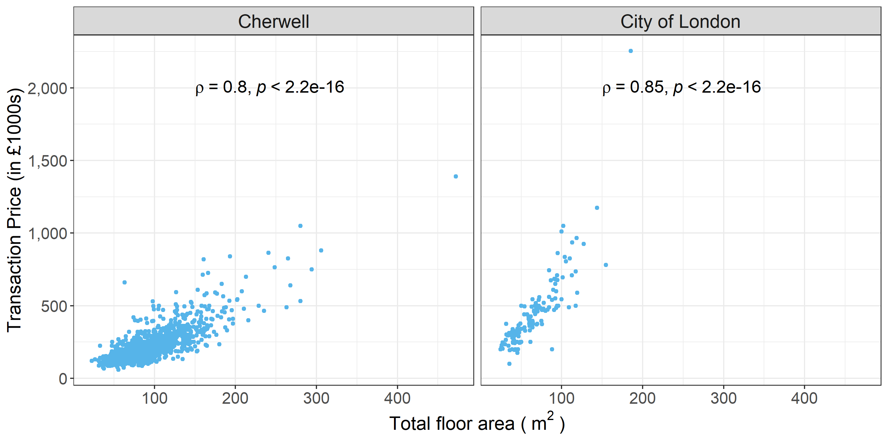

--- 
title: "Customizing ggplot2 plots in R for scientific research"

author: "Bin Chi"
date: "25/11/2020"
site: bookdown::bookdown_site
css: style.css

---

```{r setup, include=FALSE}
knitr::opts_chunk$set(echo = TRUE)
```


# {-}
{out.wide="100%"}